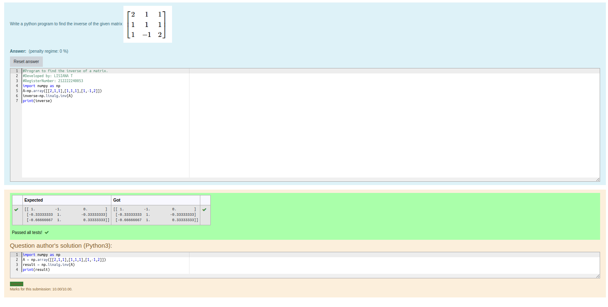

# INVERSE-OF-A-MATRIX
## Aim:
To write a python program to find the inverse of a matrix
## Equipment’s required:
1. 	Hardware – PCs
2. 	Anaconda – Python 3.7 Installation / Moodle-Code Runner
## Algorithm:
### Step 1: Import numpy as np

### Step 2: Initialize the matrix using np.array

### Step 3: Calculate the rank of the matrix using np.linalg.rank

### Step 4: Print the result

## Program:
```
#Program to find the inverse of a matrix.
#Developed by: LISIANA T
#RegisterNumber: 212222240053
import numpy as np
A=np.array([[2,1,1],[1,1,1],[1,-1,2]])
inverse=np.linalg.inv(A)
print(inverse)

```
## Output:



## Result:
Thus the inverse of given matrix is successfully solved using python program

